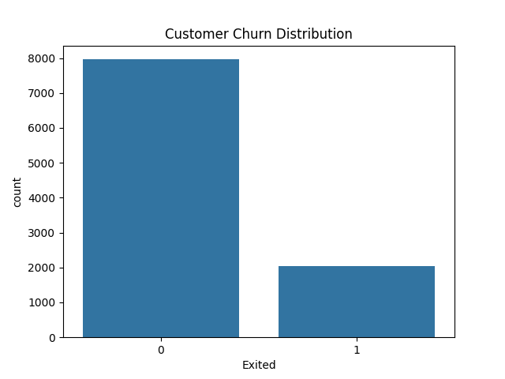
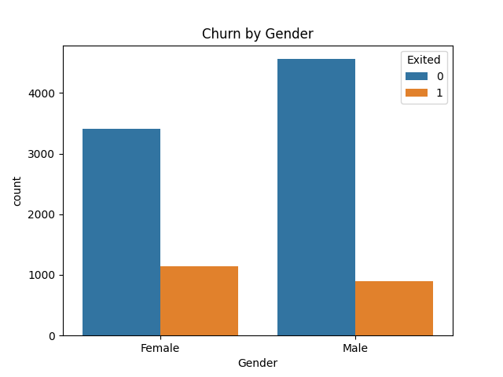
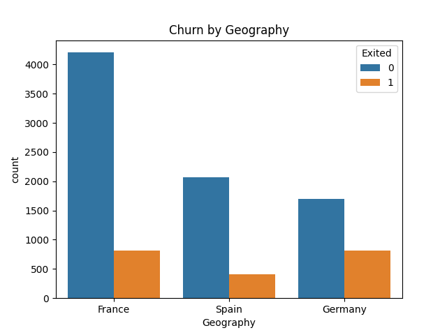
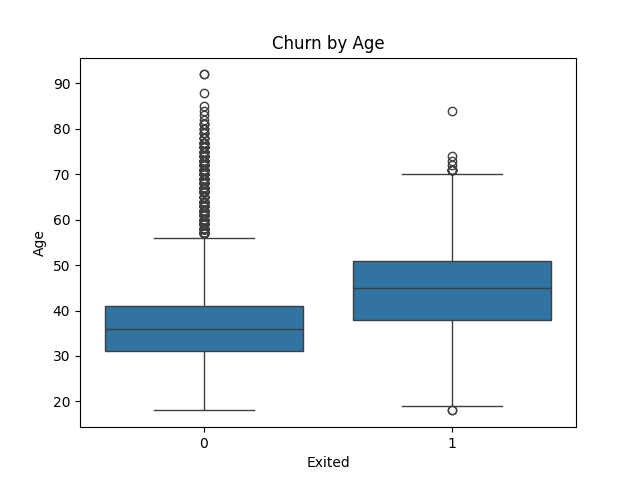
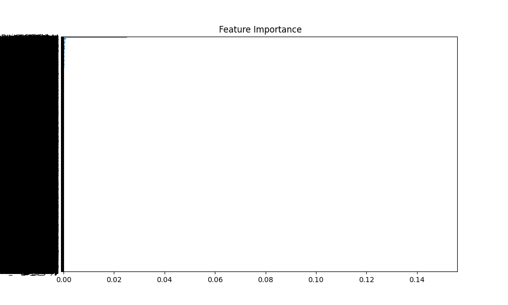

# 📊 Customer Churn Analysis

A real-world Data Analytics and Machine Learning project focused on understanding customer churn behavior and predicting customer attrition using banking customer data.

This project combines Exploratory Data Analysis (EDA), Data Visualization, Feature Engineering, and Machine Learning to identify the key factors driving customer churn and provide actionable business insights.

---

## 🚀 Project Overview

Customer churn is one of the most important business challenges faced by banks and subscription-based companies. Acquiring new customers is often more expensive than retaining existing ones.

The objective of this project is to:

* Analyze customer churn patterns
* Identify factors contributing to customer attrition
* Build a predictive model to forecast churn
* Generate business insights for customer retention strategies

---

## 📁 Dataset Information

| Attribute       | Value            |
| --------------- | ---------------- |
| Records         | 10,000 Customers |
| Features        | 14               |
| Target Variable | Exited           |
| Churn Label     | 1 = Churned      |
| Non-Churn Label | 0 = Retained     |

### Key Features

* Credit Score
* Geography
* Gender
* Age
* Tenure
* Balance
* Number of Products
* Has Credit Card
* Active Member
* Estimated Salary

---

## 🛠️ Tools & Technologies

* Python
* Pandas
* NumPy
* Matplotlib
* Seaborn
* Scikit-learn
* Jupyter Notebook
* Git & GitHub

---

## 🔄 Project Workflow

### 1. Data Exploration

* Dataset inspection
* Missing value analysis
* Data type validation

### 2. Exploratory Data Analysis (EDA)

* Churn distribution analysis
* Demographic analysis
* Customer behavior analysis

### 3. Data Preprocessing

* Label Encoding
* Feature Selection
* Train-Test Split

### 4. Model Development

* Random Forest Classifier

### 5. Model Evaluation

* Accuracy Score
* Confusion Matrix
* Classification Report

### 6. Feature Importance Analysis

* Identify top factors influencing churn

---

## 📊 Model Performance

| Metric    | Value                    |
| --------- | ------------------------ |
| Algorithm | Random Forest Classifier |
| Accuracy  | 86%                      |

The model successfully predicts customer churn with strong performance and provides valuable insights into customer behavior.

---

## 📈 Visualizations

### Customer Churn Distribution



### Churn by Gender



### Churn by Geography



### Churn by Age



### Feature Importance



---

## 🔍 Key Insights

### Customer Activity Matters

Inactive customers showed significantly higher churn rates compared to active customers.

### Age Influences Churn

Customers in higher age groups demonstrated a greater likelihood of leaving the bank.

### Geography Impacts Retention

Customer churn varied considerably across different geographic regions.

### Product Usage Affects Churn

Customers with fewer products were more likely to churn than customers using multiple banking products.

### Balance and Credit Score Influence Behavior

Balance levels and credit scores played an important role in predicting churn probability.

---

## 💼 Business Impact

This analysis can help banks:

* Identify customers at risk of churn
* Improve customer retention programs
* Increase customer lifetime value
* Reduce customer acquisition costs
* Support data-driven decision making

---

## 🎯 Skills Demonstrated

✔ Data Cleaning

✔ Exploratory Data Analysis (EDA)

✔ Data Visualization

✔ Feature Engineering

✔ Machine Learning

✔ Predictive Analytics

✔ Customer Analytics

✔ Business Intelligence

✔ Data Storytelling

---

## 📂 Project Structure

```text
Customer-Churn-Analysis
│
├── Customer_Churn_Analysis.ipynb
├── README.md
├── churn.csv
│
└── Visuals
    ├── customer_churn_Distribution.png
    ├── churn_by_gender.png
    ├── churn_by_Geography.png
    ├── churn_by_age.png
    └── feature_importance.png
```

---

## 📌 Resume Highlights

* Analyzed 10,000 customer records to identify factors influencing customer churn.
* Performed data cleaning, exploratory data analysis, and feature engineering using Python and Pandas.
* Built a Random Forest Classifier achieving 86% prediction accuracy.
* Identified key churn drivers including age, activity status, product usage, and geography.

---

## 👨‍💻 Author

**Garnipudi Nani**

GitHub:
https://github.com/GarnipudiNani

LinkedIn:
https://www.linkedin.com/in/nani-garnipudi-534817376/

---

## ⭐ If you found this project useful, consider giving it a star.
